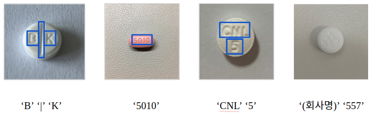
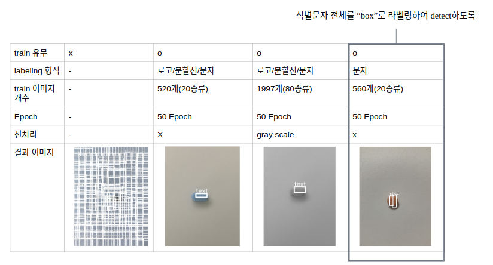
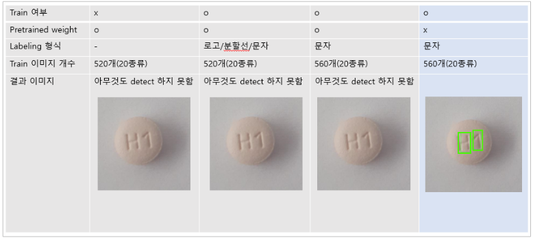
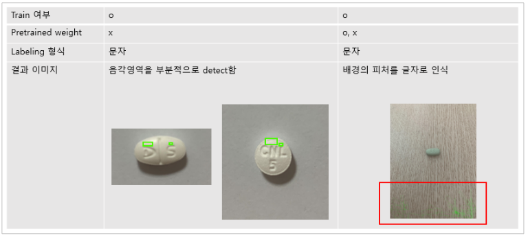
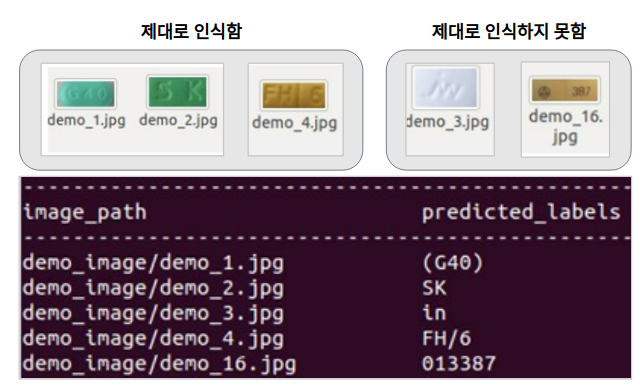

# 내 손안의 약국
EWHA CSE 졸업프로젝트-스마트폰을 이용한 알약 인식 및 정보 제공 시스템

시연 동영상: [youtube](https://youtu.be/ZV_j2W33LHY) 

​                                          

------------------------------------------------------

▪ 환자가 복용한 약의 성분을 파악해야 하는 상황에서, 기존의 경우 의사는 해당 약물을 약국에 의뢰하면 약국에서도 하나하나 검색하여 정보를 얻는다. 

▪ 대부분의 사람들은 조제약이나 시중에서 판매하는 약을 보관할 때 사용 용도를 구분해서 보관하지 않는다. 

▪ 일반 의약품 포장지에는 약의 효능이 적혀 있지만 혹여나 포장지를 잃어버린 경우에는 약이 어떠한 효능을 가지고 있는지 알 수가 없다. 

▪ 알약의 부작용에 대한 정보의 접근성이 낮아 약을 오용하는 상황이 발생한다. 

▪ 저시력자나 노인층이 알약 섭취 시 작은 글씨로 인해 약 정보를 얻기 어렵다.

위의 문제정의를 바탕으로 본 프로젝트는

**스마트폰을 이용한 알약 인식 및 정보 제공 시스템** 을 제안한다.

   

   

   

### Dataset

-------------------------------

 

 : 총 200여종의 알약을 수집

 : 다양한 촬영조건에서 찍은 알약 데이터를 얻기 위해 같은 알약을 크기/밝기/배경/촬영각도를 조절하여 스마트폰으로 촬영

: 현재까지 80종의 알약을 촬영 & 약 2000개의 알약데이터를 수집

  

  

### Labeling

------------------------------------------------------------------------

: [labelimg tool](https://github.com/tzutalin/labelImg) 사용하여 labeling 진행

: 다양한 방식으로 라벨링

1. **로고/분할선/문자 3가지 라벨로 라벨링**

   

2. **전체 식별 문자를 "box" - 1개의 라벨로 라벨링**

​     

3. **pill detection을 위한 알약 전체를 "pill"로 라벨링**

  

  

### 진행상황

--------------------------------------------

### - pill detection model

#### 1. YOLO

#### 2. EAST

   

   

  

### - text recognition model

#### 1. CRNN

  : 알약 데이터로 학습하지 않은 CRNN demo 모델로 Text Recognition을 수행

  : 기본적인 text는 잘 인식하지만, 흘림체로 적힌 경우 제대로 인식하지 못하며, 회사로고와 같은 기호를 text로 인식한다는 문제점이 있음

  

  

### Team

-------------------------------------

* 배소현 : EWHA W.UNIV.
  * [github](https://github.com/so-hyeun)

* 손수현 : EWHA W.UNIV.
  * [github](https://github.com/sonsuhyune)

* 전예진 : EWHA W.UNIV.
  * [github](https://github.com/YeJinJeon)

* 황선정 : EWHA W.UNIV.
  * [github](https://github.com/SeonjeongHwang)
