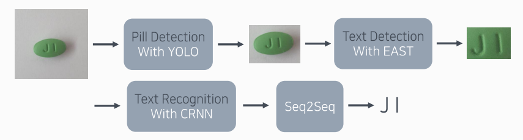
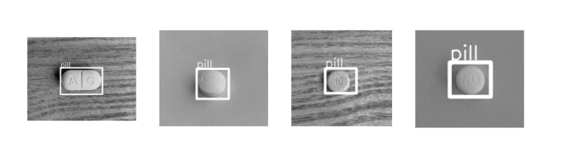

# 내 손안의 약국
EWHA CSE 졸업프로젝트-스마트폰을 이용한 알약 인식 및 정보 제공 시스템

[Android개발 Github](https://github.com/sonsuhyune/PillProject_androidApp) 
​                                          

[어플리케이션 시연영상](https://youtu.be/qbGNYfPwMvA) 

#### 문제 정의

------------------------------------------------------

▪ 환자가 복용한 약의 성분을 파악해야 하는 상황에서, 기존의 경우 의사는 해당 약물을 약국에 의뢰하면 약국에서도 하나하나 검색하여 정보를 얻는다. 

​    [기존의 경우]

▪ 대부분의 사람들은 조제약이나 시중에서 판매하는 약을 보관할 때 사용 용도를 구분해서 보관하지 않는다. 

▪ 일반 의약품 포장지에는 약의 효능이 적혀 있지만 혹여나 포장지를 잃어버린 경우에는 약이 어떠한 효능을 가지고 있는지 알 수가 없다. 

▪ 알약의 부작용에 대한 정보의 접근성이 낮아 약을 오용하는 상황이 발생한다. 

▪ 저시력자나 노인층이 알약 섭취 시 작은 글씨로 인해 약 정보를 얻기 어렵다.

위의 문제정의를 바탕으로 본 프로젝트는

**스마트폰을 이용한 알약 인식 및 정보 제공 시스템** 을 제안한다.

   

   

   

### Dataset

-------------------------------

 

 : 총 200여종의 알약을 수집

 : 다양한 촬영조건에서 찍은 알약 데이터를 얻기 위해 같은 알약을 크기/밝기/배경/촬영각도를 조절하여 스마트폰으로 촬영

: 현재까지 80종의 알약을 촬영 & 약 2000개의 알약데이터를 수집

  

  

### Labeling

------------------------------------------------------------------------

: [labelimg tool](https://github.com/tzutalin/labelImg) 사용하여 labeling 진행

: 다양한 방식으로 라벨링

1. **로고/분할선/문자 3가지 라벨로 라벨링**

   

2. **전체 식별 문자를 "box" - 1개의 라벨로 라벨링**

​     

3. **pill detection을 위한 알약 전체를 "pill"로 라벨링**

  

  

### 구현방향

-------------------------------------

**식별마크 인식**을 위해 총 4가지 모델 사용

: Pill detection - YOLO

  Text detection - EAST

  Text recognition - CRNN

  식별마크 교정 - Seq2Seq

**알약 모양 인식**을 위해 VGG 모델 사용

#### 각 모델에 대한 설명

##### Pill detection - YOLO

- 학습 결과: 87.9%의 Average precision

  

##### Text detection - EAST

* 학습 결과: 94.5%의 Average precision     

* 학습 데이터 및 테스트 데이터: 구축한 데이터에서 **알약 부분**을 코드로 일괄적으로 잘라 활용

  

##### Text recognition - CRNN

* 학습 결과: 86.39%의 Recognition accuracy     

* 학습 데이터 및 테스트 데이터: 구축한 데이터에서 **글자 부분**을 코드로 일괄적으로 잘라 활용

  

##### 식별마크 교정을 위한 Seq2Seq

* 학습 결과: 주변 context를 함께 학습한다는 모델의 특성때문에, 비교적 길이가 짧은 문자의 경우 정확도가 크게 개선되지 않음. 

  

##### 알약 모양 인식을 위한 VGG

* 식별마크를 통해 검색되는 **알약의 후보군의 수를 줄이는 보조수단**

* 알약 모양 인식을 위해 VGG 모델을 5가지의 레이블로 학습

* label: “원형”, “타원형”, “육각형”, “팔각형”, “기타” 

* 실제 정제 중 5.5%를 제외한 알약들이 4가지의 레이블에 속함

* 4가지의 레이블에 속하지 않은 알약들을 기타로 분류하여 학습 

  실제 어플리케이션에서 “기타”로 분류되는 경우에는 식별마크만 이용

* 학습 결과: 96.67%의 Acc

#### 어플리케이션 모식도

### 참고 자료

[로그인 기능 구현](https://cholol.tistory.com/397?category=572900)

[Socker 통신](https://m.blog.naver.com/PostView.nhn?blogId=davincigo&logNo=60144475819&proxyReferer=https:%2F%2Fwww.google.co.kr%2F)

[주기적인 알림 구현](https://drcarter.tistory.com/152)

[안드로이드에서 서버로 이미지 전송](https://gyjmobile.tistory.com/entry/Bitmap-%EC%9D%B4%EB%AF%B8%EC%A7%80%EB%A5%BC-byte%EB%A1%9C-%EB%B0%94%EB%A1%9C-%EB%B3%B4%EB%82%B8%EB%8B%A4%EA%B3%A0-%EA%B7%B8%EA%B2%83%EB%8F%84-%EC%86%8C%EC%BC%93%EC%9C%BC%EB%A1%9C)

[식별마크 교정을 위한 Seq2Seq](https://github.com/mdcramer/Deep-Speeling)

(팀원 기술 블로그)

[TCP Socket 통신](https://hwanglex.tistory.com/5 )

[DB에 저장된 알약 정보 가져오기](https://coding-and-ai.tistory.com/5)

[복용 알림 구현](https://suhyune-story.tistory.com/4)

[식별마크 교정 모델](https://run-jinyeah.tistory.com/5)

### Team

-------------------------------------

* 배소현 : EWHA W.UNIV.
  * [github](https://github.com/so-hyeun)

* 손수현 : EWHA W.UNIV.
  * [github](https://github.com/sonsuhyune)

* 전예진 : EWHA W.UNIV.
  * [github](https://github.com/YeJinJeon)

* 황선정 : EWHA W.UNIV.
  * [github](https://github.com/SeonjeongHwang)
